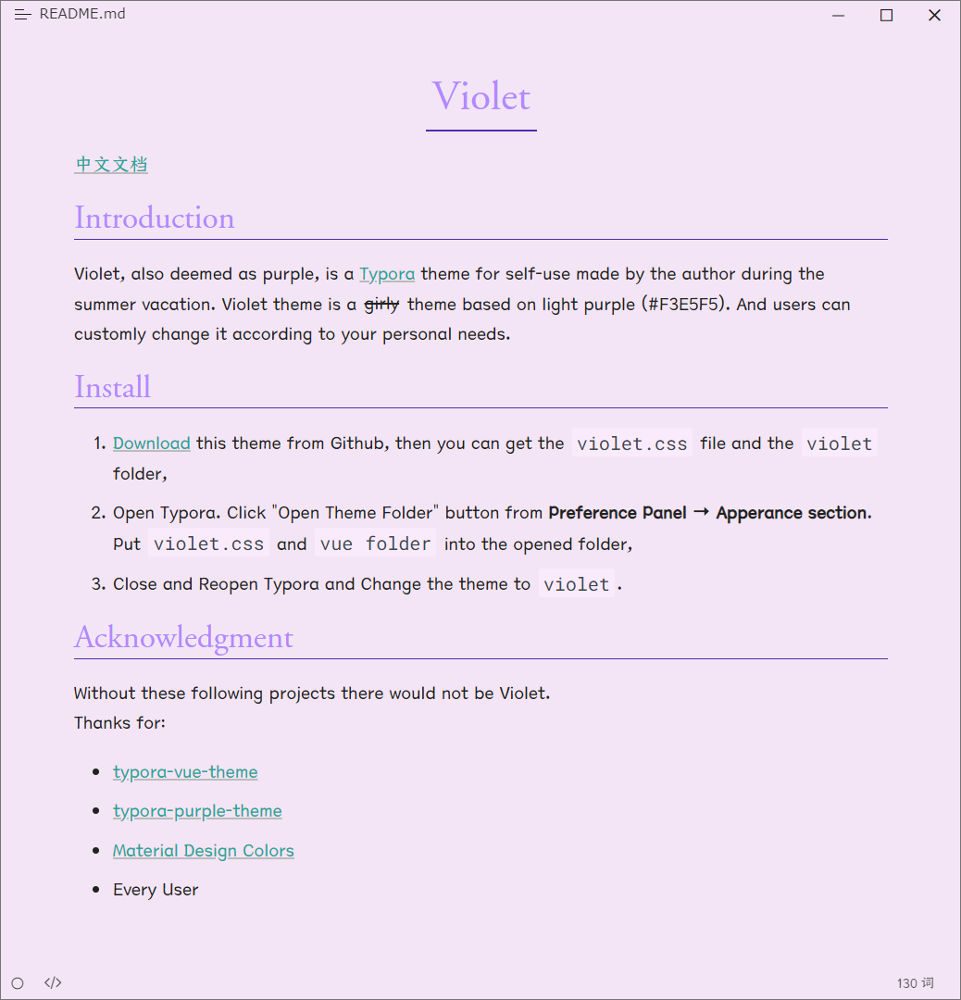

# Violet

[中文文档](README_zh-CN.md)

## Introduction

Violet, also deemed as purple, is a [Typora](https://typora.io/) theme for self-use made by the [author](https://github.com/chillcicada) during the summer vacation. Violet theme is a ~~girly~~ theme based on light purple (#F3E5F5). And users can customly change it according to your personal needs.

Both Chinese and English fonts are prohibited for commercial use.

## Install

1. [Download](https://github.com/chillcicada/typora-theme-violet/releases/download/typora-theme/violet-v0.0.8.zip) this theme from Github, then you can get the `violet.css` file and the `violet` folder,
2. Open Typora. Click "**Open Theme Folder**" button from **Preference Panel** → **Apperance section**. Put `violet.css` and `vue folder` into the opened folder,
3. Close and Reopen Typora and Change the theme to `violet`.

> In `Release` you can find the latest version.

## Preview

## Acknowledgment

Without these following projects there would not be Violet.
Thanks for:

- [typora-vue-theme](https://github.com/blinkfox/typora-vue-theme)
- [typora-purple-theme](https://github.com/hliu202/typora-purple-theme)
- [Material Design Colors](https://materialui.co/colors/)
- Every User
