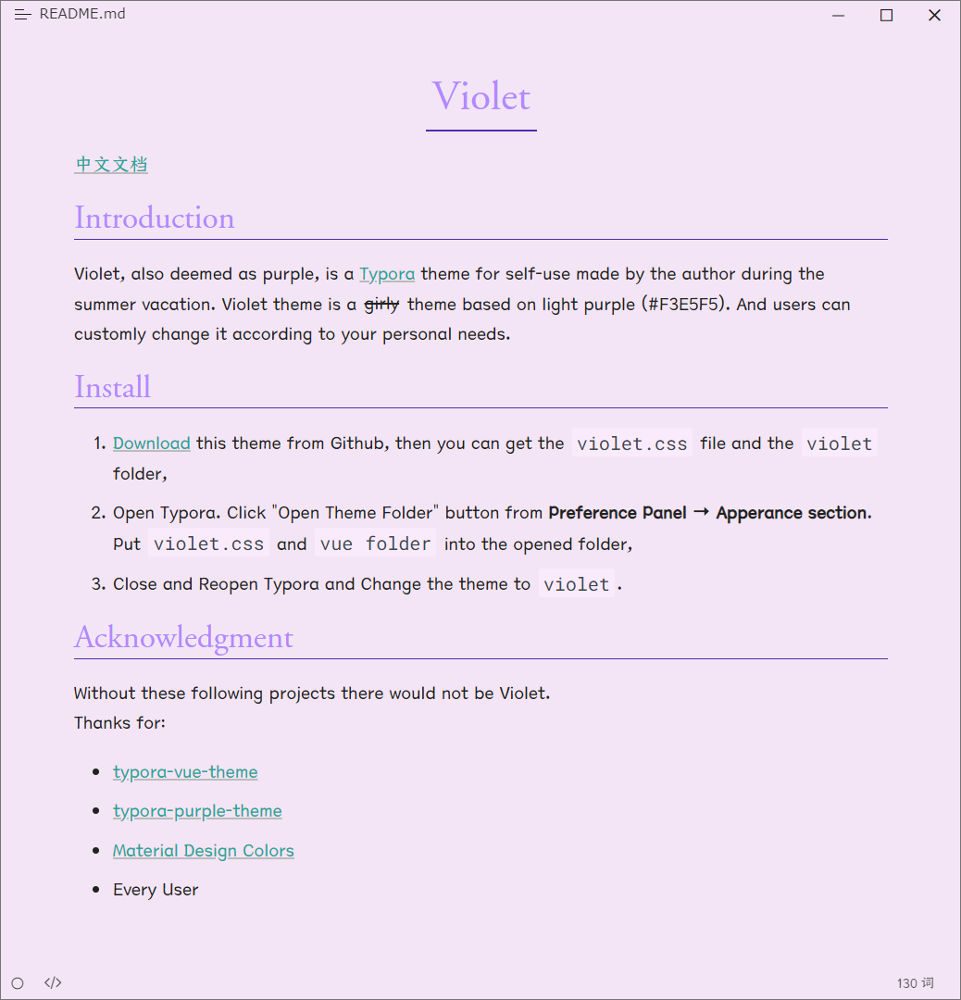

# Violet

[中文文档](README_zh-CN.md)

## Introduction

Violet, also deemed as purple, is a [Typora](https://typora.io/) theme for self-use made by the [author](https://github.com/chillcicada) during the summer vacation. Violet theme is a ~~girly~~ theme based on light purple (#F3E5F5). And users can freely change it according to your personal needs.

Both Chinese and English fonts are prohibited for commercial use.

## Installation

1. [**Download**](https://github.com/chillcicada/typora-theme-violet/releases/download/v1.0.0/violet.v1.0.0.zip) this theme from Github, **unzip** it then you can get the `violet.css` file, `violet-dark.css` file and the `violet` folder,
2. **Open** Typora. **Click** `Open Theme Folder` button from `Preferences` → `Appearance`. **Put** `violet.css` and `vue folder` into the opened folder,
3. **Restart** Typora and **Change** the theme to `violet`,
4. If you want to use "Violet Dark" only in dark mode, **enable** the `Use separate theme in dark mode` button from `Preferences` → `Appearance`, and **set** "Violet Dark" as the dark theme.

> If the `download` link don't point to the latest version, in the `Release` you can find the latest version and then download it manually.

## Preview

## Acknowledgment

Without these following projects there would not be Violet.
Thanks for:

- [typora-vue-theme](https://github.com/blinkfox/typora-vue-theme)
- [typora-purple-theme](https://github.com/hliu202/typora-purple-theme)
- [Material Design Colors](https://materialui.co/colors/)
- Every User

## Feedback

If you have any problem or meet some troubles when using Violet, it's better for you to send an issue to me at [here](https://github.com/chillcicada/typora-theme-violet/issues). Well, you can also commit your own debug code and even pull request to me.

Just enjoy it!
