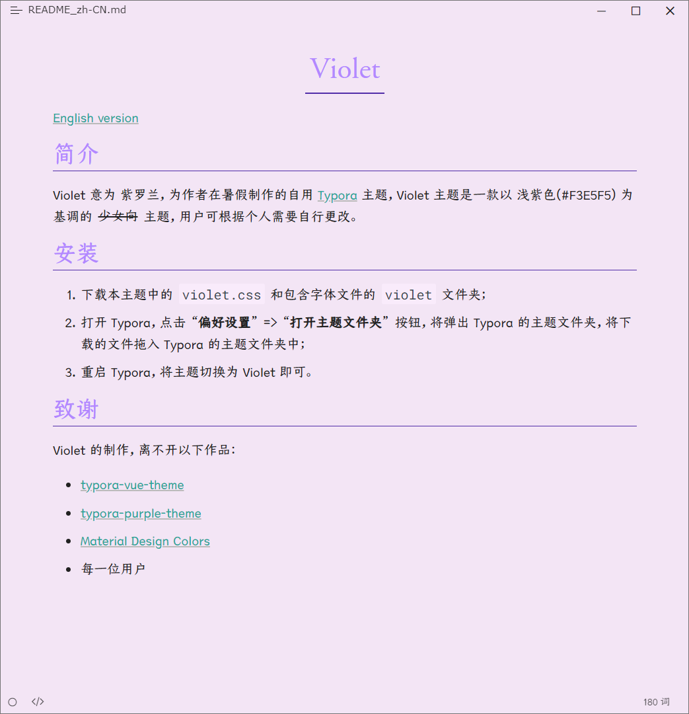

# Violet

[English Docs](README.md)

## 简介

Violet 意为 紫罗兰，为[作者](https://github.com/chillcicada)在暑假制作的自用 [Typora](https://typoraio.cn/) 主题，Violet 主题是一款以 浅紫色(#F3E5F5) 为基调的 ~~少女向~~ 主题，用户可根据个人需要自行更改。

中文字体和英文字体均禁止用于商业。

## 安装

1. [**下载**](https://github.com/chillcicada/typora-theme-violet/releases/download/v1.0.0/violet.v1.0.0.zip)，打开压缩包后将获得本主题中的 `violet.css` 文件、`violet-dark.css` 文件和包含字体文件的 `violet` 文件夹；
2. **打开** Typora，依次**点击** `偏好设置` => `外观` => `打开主题文件夹` 按钮，将弹出 Typora 的主题文件夹，将下载的文件(`violet.css` 和 `violet/`)**拖入** Typora 的主题文件夹中；
3. **重启** Typora，将主题**切换**为 Violet；
4. 如果需要仅在深色模式下应用 Violet Dark 主题，可打开 `偏好设置` => `外观` => `在深色模式下使用独立的主题` 按钮，然后将深色主题设置为 Violet Dark 即可。

> 如果下载链接没有指向最新版本，请在 `Release` 中手动找到并下载最新的版本。

## 预览

## Todo

- [ ] 添加黑夜主题

## 致谢

Violet 的制作，离不开以下作品：

- [typora-vue-theme](https://github.com/blinkfox/typora-vue-theme)
- [typora-purple-theme](https://github.com/hliu202/typora-purple-theme)
- [Material Design Colors](https://materialui.co/colors/)
- 每一位用户
