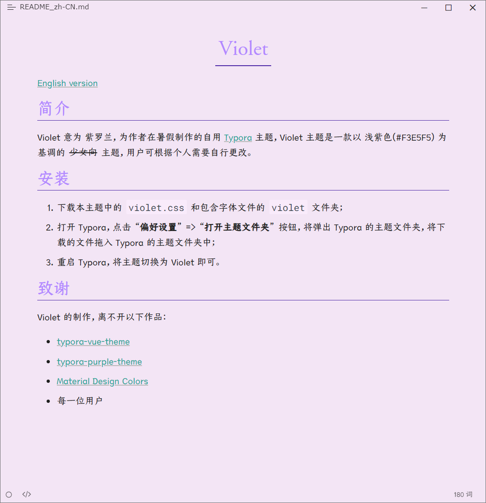

# Violet

[English version](README.md)

## 简介

Violet 意为 紫罗兰，为作者在暑假制作的自用 [Typora](https://typoraio.cn/) 主题，Violet 主题是一款以 浅紫色(#F3E5F5) 为基调的 ~~少女向~~ 主题，用户可根据个人需要自行更改。

## 安装

1. 下载本主题中的 `violet.css` 和包含字体文件的 `violet` 文件夹；
2. 打开 Typora，点击 “**偏好设置**” => “**打开主题文件夹**” 按钮，将弹出 Typora 的主题文件夹，将下载的文件拖入 Typora 的主题文件夹中；
3. 重启 Typora，将主题切换为 Violet 即可。

## 预览

## 致谢

Violet 的制作，离不开以下作品：

- [typora-vue-theme](https://github.com/blinkfox/typora-vue-theme)
- [typora-purple-theme](https://github.com/hliu202/typora-purple-theme)
- [Material Design Colors](https://materialui.co/colors/)
- 每一位用户
